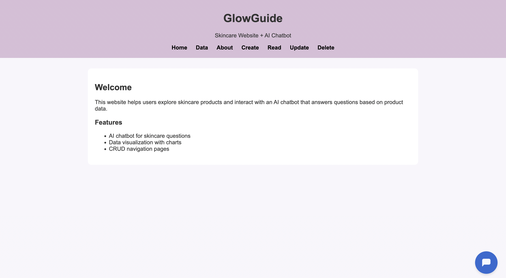

# GlowGuide AI Chatbot

GlowGuide is an AI-powered chatbot web application that provides personalized beauty recommendations through an interactive user experience. It was built to demonstrate how AI-driven tools can enhance user engagement and simplify decision-making.
## Preview

## Features
- AI chatbot powered by Botpress
- Interactive and real-time user responses
- Responsive and user-friendly interface

## Technologies Used
- HTML
- CSS
- JavaScript
- Botpress

## Live Demo
https://nadabel745.github.io/glowguide/

## Purpose
This project demonstrates my ability to build interactive web applications, integrate AI tools, and design user-focused solutions. It highlights my skills in front-end development, problem-solving, and creating meaningful user experiences.
